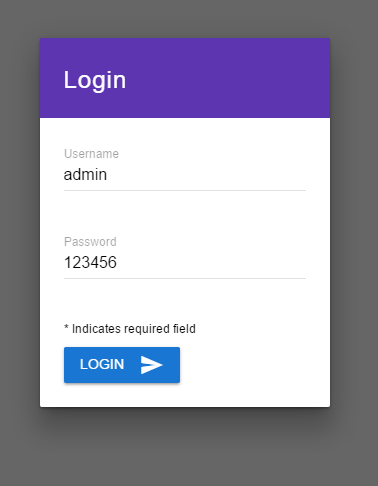
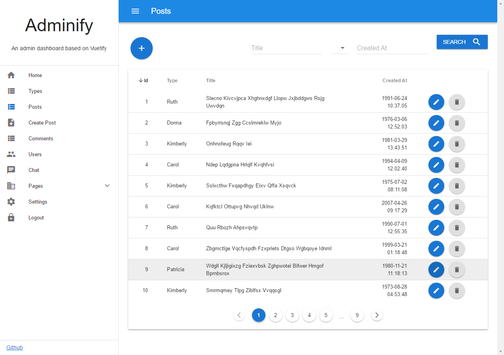
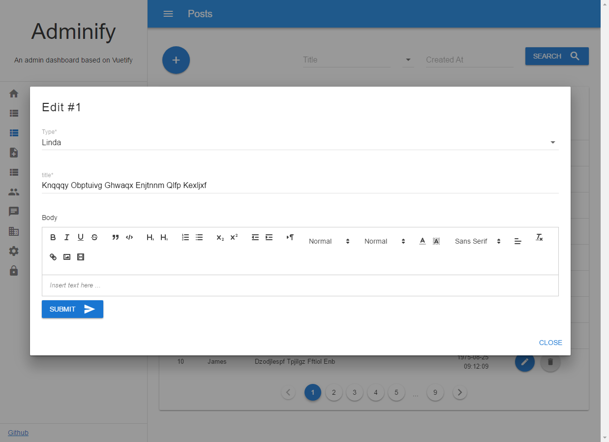
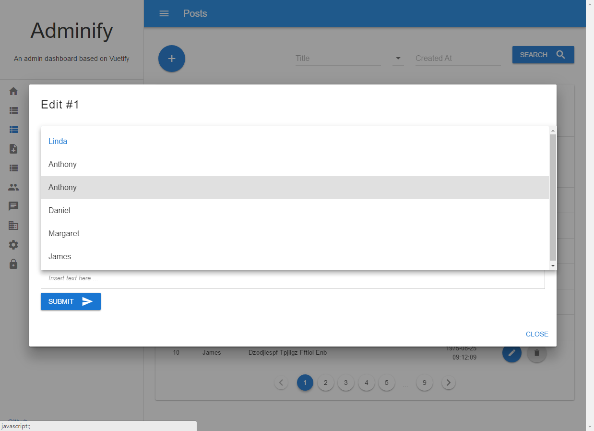
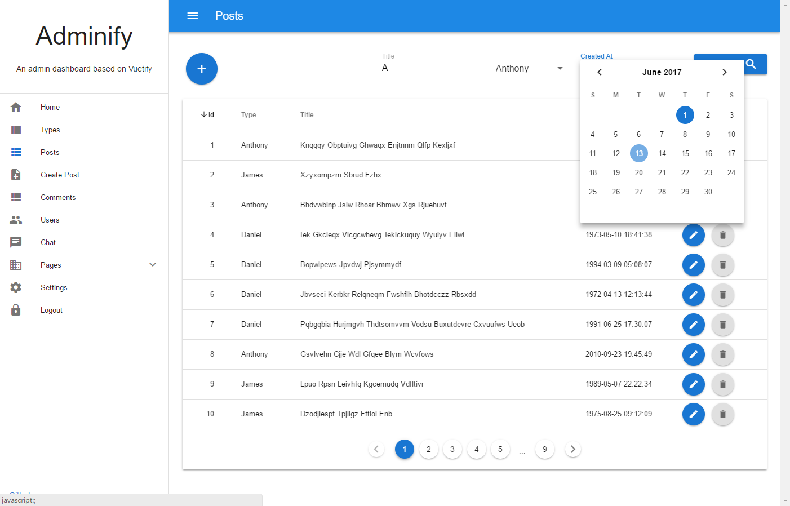
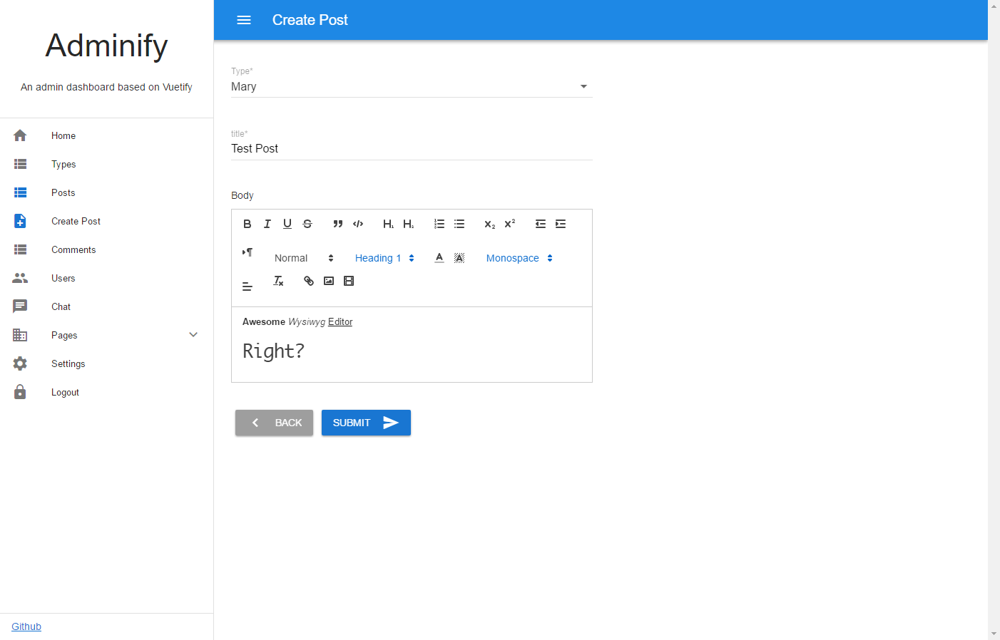
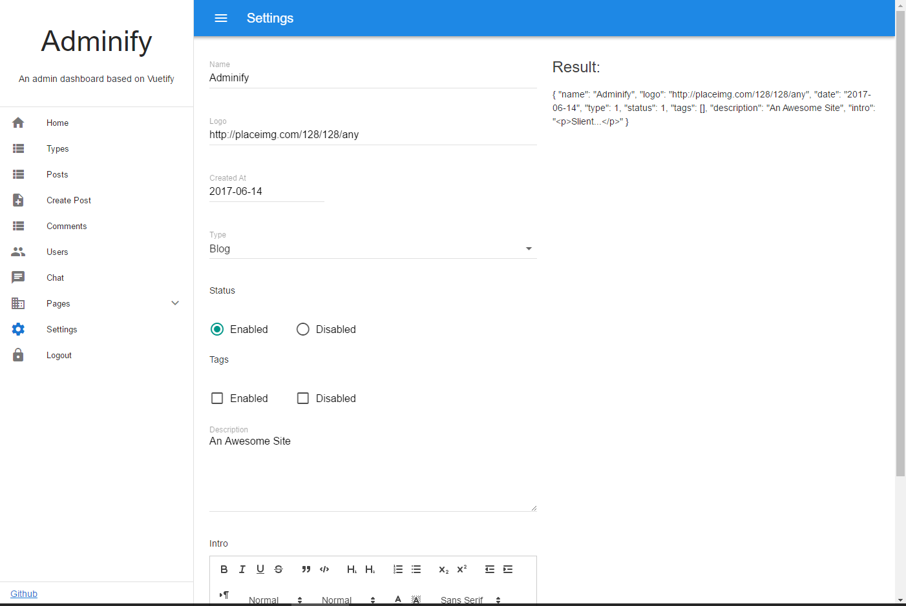

# Adminify

[](https://gitter.im/vue-adminify/Lobby?utm_source=badge&utm_medium=badge&utm_campaign=pr-badge&utm_content=badge)

- An Admin dashboard based on [Vuetify](https://vuetifyjs.com/) .
- Data in demo use `axios-mock-adapter`
- Better Server API is built on [AdonisJs](http://www.adonisjs.com/) . 
- Also welcome to [Adonis China](https://adonis-china.org/) .

## Live Demo
[http://adminify.genyii.com](http://adminify.genyii.com)


## Features
- Vue + Vue Router + Vuex + Axios.
- Material Design Style - [Vuetify](https://vuetifyjs.com/)
- Data Grid with server side `sort`,`search`,`pagination` and json config.
- Dynamic Form Builder with `text`,`textarea`,`radios`,`checkboxes`,`select`,`html` input types and json config.
- Built in `localStorage` proxy for any data types.
- Axios Mock with `axios-mock-adapter`
- Configurable side menu with json
- i18n with `vue-i18n`
- `Basic` and `Main` layouts
- Stylus processor
- And more of your requests.

## Getting start
1. `git clone https://github.com/wxs77577/adminify.git`
1. Copy `src/config.sample.js` to `src/config.js`
1. `npm install`
1. `npm run dev`
1. **Remove `line:6 ~ line:9` in `/src/http.js` to speed up page loading if you don't need http mock.**

> Use `cnpm` instead `npm` in China


## Screenshots
|  |  |
|---|---|
|||
|||
|||
|||

## Config
> `src/config.js`
```javascript
const baseUrl = 'http://localhost:3333'
const config = {
  locale: 'en-US', //en-US, zh-CN
  url: baseUrl,
  debug: {
    mock: 1, //enable mock
    http: true, //http request log
  },
  api: `${baseUrl}/admin/api`
  // locale: 'en', //en
  // api: 'http://192.168.1.108:3333/admin/api'
}
```

## Menu Config
> `src/menu.js`
```javascript
export default [
  { "href": "/", "title": "Home", "icon": "home" },
  { "href": "/crud/types", "title": "Types", "icon": "view_list" },
  { "href": "/crud/posts", "title": "Posts", "icon": "view_list" },
  { "href": "/crud/posts/create", "title": "Create Post", "icon": "note_add" },


  { "href": "/crud/comments", "title": "Comments", "icon": "view_list" },
  { "href": "/crud/users", "title": "Users", "icon": "people" },
  
  
  
  { "href": "/chat", "title": "Chat", "icon": "chat" },
  {
    "title": "Pages",
    "icon": "domain",
    "items": [
      { "href": "/example", "title": "Example" },
      { "href": "/about", "title": "About" }
    ]
  },
  { "href": "/settings", "title": "Settings", "icon": "settings" },

  { "href": "/login", "icon": "lock", "title": "Logout" }
]
```
>  No more explaination needed right?

## Routes
> Part of `src/router.js`


```javascript
  // The signature of `route` function :
  function route(path, file, name, children) {}

  //routes
  [
    route('/login', 'Login', 'login'),
    route('/error', 'Error', 'error'),

    //path, file(*.vue), name, children
    
    route('/', 'Main', null, [
      route('/', 'Home', 'home'),
      route('/crud/:resource', 'CrudGrid', 'grid'),
      route('/crud/:resource/:id/edit', 'CrudForm', 'edit'),
      route('/crud/:resource/create', 'CrudForm', 'create'),
      route('/crud/:resource/:id/:action', 'CrudForm', 'action'),
      route('/crud/:resource/:action', 'CrudForm', 'indexAction'),
      route('/example', 'Example'),
      route('/settings', 'Settings'),
      route('/theme', 'Theme'),
      route('/chat', 'Chat'),
      route('/about', 'About'),
    ]),
    

    // Global redirect for 404
    { path: '*', redirect: '/error', query: {code: 404, message: 'Page Not Found.'} }
  ]
```

## Grid View Config
> `src/mock/index.js`
```javascript
mock.onGet('/types/grid').reply(200, {
  "options": {
    "sort": "id", //default sort column
    "create": false, //show Create button
    "update": true, //show update button
    "delete": false //show delete button
  },
  "filters": {
    "model": {
      "name": "",
      "created_at": ""
    },
    "fields": { //filters fields config
      "name": {
        "label": "Name"
      },
      "created_at": {
        "label": "Created At",
        "type": "date"
      }
    },
    "rules": {}
  },
  "columns": [ //columns config
    {
      "text": "Id", //column header text
      "value": "id" //field name
    },
    {
      "text": "Name",
      left: true, //make text align left, default is right
      "value": "name"
    }
  ]
});
```

## Grid View Data 
> `src/mock/index.js`
```javascript
mock.onGet(/\/(posts|users|types|comments)$/).reply(({ params = { page: 1, perPage: 10 }, url }) => {
  let resource = url.split('/')[1]
  let offset = (params.page - 1) * params.perPage
  let models = data[resource]
  return [200, { //return like this format
    currentPage: params.page,
    lastPage: Math.ceil(models.length / params.perPage),
    perPage: params.perPage,
    total: data[resource].length,
    data: models.slice(offset, offset + params.perPage)
  }]
});
```

## Form Builder Config
> `src/mock/index.js`

```javascript
mock.onGet('/settings/form').reply(({ params }) => {
  return [200, {
    "model": { //form model
      name: 'Adminify',
      logo: 'http://placeimg.com/128/128/any',
      date: null,
      
      type: 1,
      status: 1,
      
      tags: [],
      description: 'An Awesome Site',
      intro: '',
    },
    "fields": { //form fields
      "name": {label: 'Name'}, //default type is 'text'
      "logo": {label: 'Logo', type: 'image'}, //working in progress
      "date": {label: 'Created At', type: 'date'},
      "type": {label: 'Type', type: 'select', options: [
        {text: 'Blog', value: 1},
        {text: 'Company', value: 2},
        {text: 'Game', value: 3},
      ]},
      "status": {label: 'Status', type: 'radios', width: 'md3', options: [
        {text: 'Enabled', value: 1},
        {text: 'Disabled', value: 2}
      ]},
      "tags": {label: 'Tags', type: 'checkboxes', width: 'md3', options: [
        {text: 'Enabled', value: 1},
        {text: 'Disabled', value: 2}
      ]},
      "description": {label: 'Description', type: 'textarea'},
      "intro": {label: 'Intro', type: 'html'},
    }
  }]
})
```

## Comunication
### Gitter IM 
[https://gitter.im/vue-adminify/](https://gitter.im/vue-adminify/)
